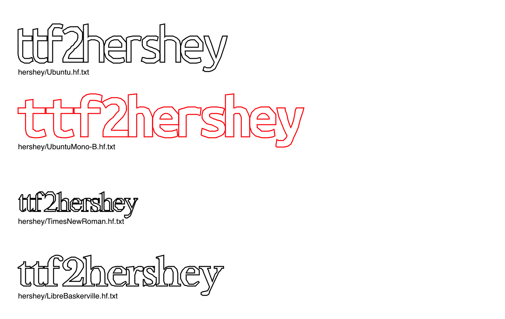

# ttf2hershey

Convert True Type Fonts (.ttf) to Hershey vector fonts
([Live Demo](https://lingdong-.github.io/ttf2hershey/))

> The Hershey fonts are a collection of vector fonts developed c. 1967 by Dr. Allen Vincent Hershey at the Naval Weapons Laboratory, originally designed to be rendered using vectors on early cathode ray tube displays. The fonts are publicly available and have few usage restrictions. Vector fonts are easily scaled and rotated in two or three dimensions; consequently the Hershey fonts have been widely used in computer graphics, computer-aided design programs, and more recently also in computer-aided manufacturing applications like laser engraving. ([Wikipedia](https://en.wikipedia.org/wiki/Hershey_fonts))


This tool converts the common True Type Font (.ttf) files to Hershey font format. A few pre-converted samples can be found in the `./hershey` folder.



## Dependencies
- Python 2

## Usage

### Quick Start

First `cd` into the directory, then

```
python ttf2hershey.py path/to/font.ttf > path/to/output.hf.txt
```
Done! you can find the generated hershey font at `path/to/output.hf.txt`.

### Use as Module

```python
from ttf2hershey import *
output_str = tohershey("ABCDEFG0123",font_path="font.ttf",kern=2)
print output_str
```
- First argument: the set of characters to be encoded. This can be the 95 printable ASCII characters, or other unicode characters as you like, as long as the font has them.
- `font_path`: this is the path to your ttf file to be converted
- `kern`: this is the amount of extra spacing to the left and right of a character. At `kern=0`, all characters are squeezed together. However the more kern you put, the less accurate the vertices are, since there're only 95 possible values for a coordinate in a Hershey font.

### Character Mapping

The original Hershey fonts are indexed differently from unicode, so there're tables for mapping characters to Hershey font's special index. In this implementation however, the index is exactly the same as unicode entry point, so no mapping is required.

### Parsing & Rendering

An example Hershey font parser & renderer in javascript and [p5.js](http://p5js.org) is included in `./p5-hershey`, which is used to drive the [Live Demo](https://lingdong-.github.io/ttf2hershey/).


## Known Issues

- There're multiple ways to encode `cmap` (which maps unicode characters to glyph indices) in a TTF file. Only parsing of the most common is implemented (PlatformID = 0, Format = 4).


## Resources

- http://paulbourke.net/dataformats/hershey/
- https://docs.microsoft.com/en-us/typography/opentype/spec
- https://developer.apple.com/fonts/TrueType-Reference-Manual
- http://stevehanov.ca/blog/index.php?id=143